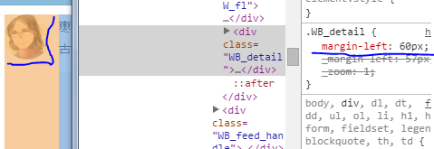

# css实现左右布局

----------
　　css实现左右布局显示是前端进行页面设计的基础，也是全面了解并学习css一个很好的切入点，因为其中会涉及到对许多css基础点的认知。实现css入门，理解左右布局的实现方式是必经之路，同时也能使我们在项目中涉及前端编码的部分受益。　

　　下面我们就介绍自己总结的`7`种css实现前端左右布局的方式，如还有其他方式，请告诉我。

##1. [table](table.html)---[table的li实现](table-li.html)
####实现原理：
　　table标签是能够具有实现左右布局的属性，也是我们项目中使用最多的。table布局也是页面布局中使用的最早的布局方式，随着前端技术的发展，table布局由于自身的局限性逐渐被div布局取代。
####查看代码（主要代码）：
    <table class="sTable">
        <tr>
        	<td class="col-4 c1">1</td>
        	<td class="col-4 c2">2</td>
        	<td class="col-4 c3">3</td>
        	<td class="col-4 c4">4</td>
        </tr>
        <tr>
        	<td class="col-4 c5" colspan="2">5</td>
        	<td class="col-4 c6" colspan="2">6</td>
        </tr>
        <tr>
        	<td class="col-4 c2">7</td>
        	<td class="col-4 c3">8</td>
        </tr>
        <tr>
        	<td class="col-4 c2" rowspan="2">9</td>
        	<td class="col-4 c3">9</td>
        </tr>
        <tr >
        	<td class="col-4 c4">10</td>
        	<td class="col-4 c3">8</td>
        </tr>
        <tr >
        	<td class="col-4 c4">10</td>
        	<td class="col-4 c3">8</td>
        </tr>
    </table>
###代码说明：
tr表示一行，td表示一列，先实现行再实现列，所以tr中可以添加td实现盒子的左右布局。另:由于table布局由于性能问题已经逐渐被放弃使用，所以提供了table的li标签实现，供参考。

##2. [inline-block](inline-block.html)
###实现原理：
**display**:inline-block属性是介于`行级元素(display:inline)`和`块级元素(display：block)`之间的属性，它可以像行级元素一样水平布局，也可以像块级元素设置宽高属性，所以使用它可以进行左右布局。另：它不支持ie6、7浏览器，请注意，但是可以使用inline进行`hack`处理。
###查看代码：
    html:
    <section class="section">
		

			
1

			
2

			
3

			
4

			
5

			
6

		

	</section>
    css:
    .col-4{
		display: inline-block;
		*display: inline;
		*zoom:1; //ie6、7hack
		width:25%;
		height:30px;
		border:1px solid #999;
		font-size: 14px;
	}
	.wrap{
    	margin:10px auto;
    	max-width:1280px;
    	min-width:1024px;
    	font-size: 0px;
    }
###代码说明：
无
##3. [float实现左右布局](float.html)
###实现原理：
float属性是css中关于布局的一个关键属性，其意为将该块状区域脱离父级标签的文档流，left属性值使该区域向父级标签区域的左侧边界放置，right属性值使该区域块向父级标签的右侧边界放置，如是利用该属性可以实现左右布局。
float属性属于布局属性，其中有着很多重要应用。
> float属性的三个特性为：
> 
> - a、包裹性：可以按照区域块中子元素的实际宽度进行包裹；
> - b、破坏性：float区域块不会被父级区域块包裹，造成前端常见的高度塌陷问题，解决办法是`清除浮动`；
> - c、占位性（个人称呼），浮动区域块虽然是脱离了父级区域，但是它是要占用一定的正常流区域的，即如果不清除浮动，我们会看到它会占用它后面的同级元素（如果没有会占用它父级后面的同级元素，如果还是没有则向上追溯）的区域，影响同级元素，所以常见清浮动。
> -  以上三特性为进阶部分，刚兴趣的同学可以课后研究。

###查看代码：
    <section class="section">
		

			
1

			
2

			
3

			
4

			
5

			
6

			
dgdgdg

		

	</section>

    .col-4{
		float:left;
		width:25%;
		height:30px;
		border:1px solid #999;
		box-sizing:border-box;/*盒子模型*/
	}
	.wrap{
    	margin:10px auto;
    	max-width:1280px;
    	min-width:1024px;
    }
###代码说明：
float布局部分和inline-block布局部分比较相似，但是其中最主要的区别是：将

    .c1{height:60px}
以后就会发现float布局对于后面节点的布局采用**交错式**的布局，inline-block采用**正常式**的布局。（个人称呼，理解即可，不用在乎怎么称呼）
##4. [基于css3中flexbox属性实现左右布局](flexbox.html)
###实现原理：
css3中出现了弹性盒子布局，即display:box;该种布局主要用于移动前端开发，因为该属性不支持ie6、7、8，支持chrome，firefox，ie9+，同时在移动端，主要是ios和Android中基于webkit内核的浏览器都是支持的，所以也是一种好的布局方式。
###查看代码：
    <section class="section">
		

			
1

			
2

			
3

			
4

		

		

			
5

			
6

		

	</section>
    .wrap{
    	margin:10px auto;
    	max-width:1280px;
    	min-width:1024px;
    }
    .wrap{
    	display: -webkit-box;
    	-webkit-box-orient: horizontal;
    }
    .col-4{
		height:30px;
		border:1px solid #999;
		-webkit-box-flex:1;
    }
###代码说明：
在父元素中定义display：-webkit-box;在想要布局的部分定义box-flex设置宽度，实现区域的左右布局，具体请参见[css手册](http://www.css88.com/book/css/)
##5. [float+margin实现左右布局](float&margin.html)
###实现原理：
该部分以及向下主要说明两栏的左右布局的实现。
float能够使得元素向左或者向右靠边布局，如果在同级元素中设置一个正常流的区域与浮动块并列，则浮动块会在该正常流同级区域的边界处，只是浮动块会影响该区域块的布局，所以要清除浮动块的影响，所以此时将正常流区域块的盒子设置margin等于浮动块的宽度既可以清除影响。

新浪微博采用如此方式：

> 补充：由margin→盒模型：
> [css盒模型](boxModule.html)是css的基础一环，css盒子从内到外一次有内容-padding-border-margin组成，可以通过设置各个值来设置间距。
> 另：对于不同的文档模式其宽度和高度解析不同，
> 
> - 对于ie下怪异文档模式或者标准文档模式下定义了css3中的`box-sizing：border-box`的元素，css中设置的宽高都是内容区宽高+padding+border的；
> 
> - 标准文档下或者定义了css3中box-sizing:content-box的元素，css中定义的元素宽高就是内容区的宽高。

###查看代码：
    <header class="header">
		

			
left

			
right

		

	</header>
    .header{
	    	background-color: #ccc;
	    	padding:1px;
	    }	
	    .wrap{
	    	margin:10px auto;
	    	max-width:1280px;
	    	min-width:1024px;
	    }
	    .hLeft{
	    	float:left;
	    	border:1px solid #999;
	    	width:15%;
	    	height: 50px;
	    }
	    .hRight{
	    	/*overflow: hidden;
	    	zoom:1;*/
	    	height:50px;
	    	border:1px solid #999;
	    	margin-left:15%;
	    }
	    .box{
	    	height: 30px;
	    	background-color: red
	    }
###代码说明：
其中`margin-left:15%;`去除了浮动对同级元素产生的影响。
##6. [block formate context(float+overflow)实现左右布局](bfc.html)
###实现原理：
对于float对后面同级元素的影响，除了采用margin进行影响的清除，还可以在受影响的元素上添加overflow：hidden来清除浮动对该区域块带来的影响。具体原理是块级格式化上下文（BFC）的应用。
关于bfc的进阶了解，可以参见[文章](http://www.cnblogs.com/lhb25/p/inside-block-formatting-ontext.html)。

###查看代码：
    <header class="header">
		

			
left

			
right

			<!-- 
hhh hhh jjj sss
 -->
		

	</header>
     .header{
	    	background-color: #ccc;
	    	padding:1px;
	    }	
	    .wrap{
	    	margin:10px auto;
	    	max-width:1280px;
	    	min-width:1024px;
	    }
	    .hLeft{
	    	float:left;
	    	border:1px solid #999;
	    	width:15%;
	    	height: 90px
	    }
	    .hRight{
	    	overflow: hidden;
	    	zoom:1;
	    	height:50px;
	    	border:1px solid #999;
	    }
	    .box{
	    	margin:10px;
	    	border:1px solid #888;
	    }
	    .cbox{
	    	height:20px;
	    	background-color: #ccc;
	    	margin:25px;
	    	float:left;
	    	width:100%;
	    }
	    .clear{
	    	clear:both;
	    }
###代码说明：
关键所在：`.hRight{overflow: hidden;}`,作用在受影响的区域块。
##7. [position:absolute左右布局](position.html)
###实现原理：
除了float可以产生脱离文档流的布局现象以外，position：absolute也可以，但是二者又有不同之处。不同之处在于absolute可以覆盖任何位置的元素且不会影响正常流的布局，但是会产生遮盖，所以要求正常流要躲避绝对布局的遮挡。躲避方式可以使用margin。

###查看代码：
    <header class="header">
		

			
left

			
right

		

	</header>
    .header{
	    	background-color: #ccc;
	    	padding:1px;
	    }	
	    .wrap{
	    	margin:10px auto;
	    	max-width:1280px;
	    	min-width:1024px;
	    	position: relative;
	    }
	    .hLeft{
	    	position: absolute;
	    	left:0;
	    	top:0;
	    	width:15%;
	    	height: 50px;
	    	border:1px solid #999;
	    }
	    .hRight{
	    	height:50px;
	    	border:1px solid #999;
	    	margin-left:15%;
	    }
	    .box{
	    	height: 30px;
	    	background-color: red
	    }
###代码说明：
左侧部分采用绝对布局，右侧正常流，但是使用margin躲避遮挡。

##结束语
css属性可以大致分类为布局属性和效果属性（个人理解），布局属性主要有display;inline|block|inline-block、float:left|right|none、position:absolute|fixed|relative，各个不同属性对应的属性值对应了各种布局方式的实现；效果属性主要是color、background、border等等，主要修改外观，不影响布局。

